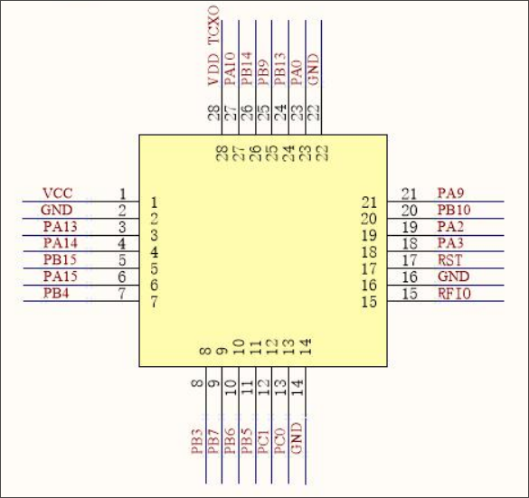

# Rust long range radio mesh
For the xiao esp32c3 with the xiao SX1262 module  

Load bootloader:
    `cd bootloader && cargo run --release`

Run with:   
    `ADDRESS=1 cargo run --release`  
    `ADDRESS=2 cargo run --release`  
    `ADDRESS=... cargo run --release`  

Verbose debugging logging:
    `ADDRESS=2 cargo run --release --features debug`  

*If having trouble loading the program/bootloader*
*Try plugging the probe in to the usb first then plug in the target board*
*`openocd -f interface/cmsis-dap.cfg -f target/stm32wlx.cfg -c "init; reset halt; stm32l4x unlock 0; reset halt; exit"`*

# WIO-E5

### Wio-E5 Pinout

| Pin | Name | Type | Description |
|-----|------|------|-------------|
| 1   | VCC  | -    | Supply voltage for the module |
| 2   | GND  | -    | Ground |
| 3   | PA13 | I    | SWDIO for program download |
| 4   | PA14 | I/O  | SWCLK for program download |
| 5   | PB15 | I/O  | SCL of I2C2 from MCU |
| 6   | PA15 | I/O  | SDA of I2C2 from MCU |
| 7   | PB4  | I/O  | MCU GPIO |
| 8   | PB3  | I/O  | MCU GPIO |
| 9   | PB7  | I/O  | UART1_RX from MCU |
| 10  | PB6  | I/O  | UART1_TX from MCU |
| 11  | PB5  | I/O  | MCU GPIO |
| 12  | PC1  | I/O  | LPUART1_TX from MCU |
| 13  | PC0  | I/O  | LPUART1_RX from MCU |
| 14  | GND  | -    | Ground |
| 15  | RFIO | I/O  | RF input/output |
| 16  | GND  | -    | Ground |
| 17  | RST  | I/O  | Reset trigger input for MCU |
| 18  | PA3  | I/O  | USART2_RX from MCU |
| 19  | PA2  | I/O  | USART2_TX from MCU |
| 20  | PB10 | I/O  | MCU GPIO |
| 21  | PA9  | I/O  | MCU GPIO |
| 22  | GND  | -    | Ground |
| 23  | PA0  | I/O  | MCU GPIO |
| 24  | PB13 | I/O  | SPI2_SCK from MCU; Boot pin (active low) |
| 25  | PB9  | I/O  | SPI2_NSS from MCU |
| 26  | PB14 | I/O  | SPI2_MISO from MCU |
| 27  | PA10 | I/O  | SPI2_MOSI from MCU |
| 28  | PB0  | I/O  | Unavailable; suspended treatment |

### I2C Display (Optional)

An SSD1306 128x64 OLED display can be connected on I2C2 (PB15/PA15). The
display is fully optional — if it is not detected at boot the mesh node
continues to operate normally and retries the connection every 10 seconds.
If the display disconnects at runtime it is automatically marked offline
and re-probed on the same interval.

### Pin Allocation

| Function | Pins | Notes |
|----------|------|-------|
| SWD      | PA13 (SWDIO), PA14 (SWCLK) | Pins 3-4, dedicated |
| I2C2     | PB15 (SCL), PA15 (SDA) | Pins 5-6 |
| UART1    | PB6 (TX), PB7 (RX) | Pins 9-10, gateway serial to Linux box |
| SPI2     | PB13 (SCK), PB14 (MISO), PA10 (MOSI), PB9 (NSS) | Pins 24-27, note PB13 is also boot pin |
| GPIO     | PB4, PB3 | Pins 7-8 |

*SPI SCK must remain inactive for boot*

 

*Claude Code was utilized in the development process.*
