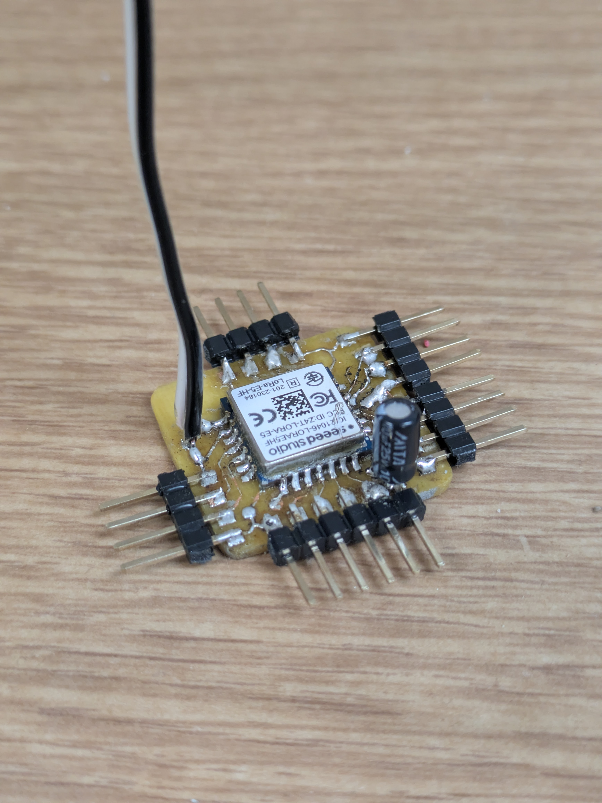
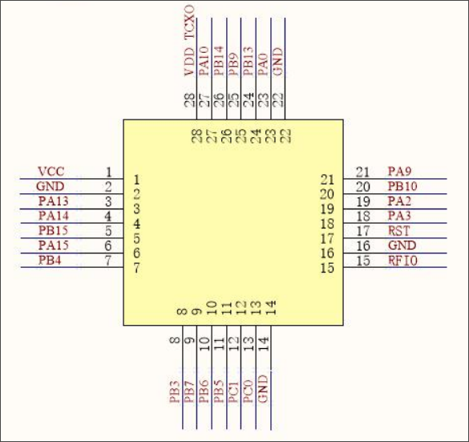

# Rust long range radio mesh
For the STM32WLE5 WIO-E5 module  

Load bootloader (one-time; no RTT output, Ctrl-C once flashed):
    `cargo run --release -p bootloader`

Run with:   
    `ADDRESS=1 cargo run --release`  
    `ADDRESS=2 cargo run --release`  
    `ADDRESS=... cargo run --release`  

Verbose debugging logging:
    `ADDRESS=2 cargo run --release --features debug`  

Attach:
`probe-rs attach --chip STM32WLE5JCIx --rtt-scan-memory target/thumbv7em-none-eabi/release/sx1262-mesh-rs`

### Build-time configuration

The firmware is configured at build time through environment variables and
cargo features. Because these are compile-time constants, changing one triggers
a rebuild; the value is baked into the flashed image.

| Flag | Values | Default | Purpose |
|------|--------|---------|---------|
| `ADDRESS` | `1`-`255` | `1` | This node's mesh address |
| `LORA_PRESET` | `fast`, `long`, `max`, `extreme` | `fast` | LoRa range/airtime trade-off (see below) |
| `FW_VERSION` | `0`-`65535` | `1` | Firmware version for OTA downgrade prevention |
| `--features debug` | (flag) | off | Verbose RTT logging |

Example:
    `ADDRESS=2 LORA_PRESET=max cargo run --release`

#### LORA_PRESET

Selects the spreading factor, bandwidth and coding rate. Higher presets trade
throughput and on-air time for receiver sensitivity (link budget, i.e. range).
Every preset transmits at the maximum +22 dBm; only the modulation changes. The
TX timeouts and the mesh listen window scale automatically with the preset.

| Preset | SF | BW | CR | Rx sensitivity | ~Range | Airtime (~40 B) |
|--------|-----|--------|-----|-----------|--------|-----------------|
| `fast` (default) | SF7 | 125 kHz | 4/5 | -124 dBm | 1x | ~0.1 s |
| `long` | SF10 | 125 kHz | 4/5 | -132 dBm | ~2.5x | ~0.6 s |
| `max` | SF12 | 125 kHz | 4/8 | -137 dBm | ~4x | ~3.3 s |
| `extreme` | SF12 | 62.5 kHz | 4/8 | -140 dBm | ~5.5x | ~6.6 s |

Both ends of a link must use the same preset to communicate. The higher presets
have multi-second airtime, so throughput is low and only one node can transmit
at a time; they also exceed the FCC 400 ms channel dwell limit for the 902-928
band, so use them only where that is acceptable. `extreme` narrows the
bandwidth and relies on the module's TCXO for frequency stability.

### Basestation

The basestation node bridges the mesh network to a host PC via a single UART
connection (RS232 TTL 3.3V FTDI adapter). OTA firmware updates and data relay
are multiplexed on one link using a framed protocol.

Build and flash:
    `ADDRESS=10 cargo run --release -p basestation`

UART wiring (USART1, pins 9-10 on the Wio-E5 module):

| Pin  | Function | Connect to |
|------|----------|------------|
| PB6  | TX       | FTDI RX    |
| PB7  | RX       | FTDI TX    |

Python host tools (requires `pyserial`, `tqdm`):

    cd basestation/host
    pip install -r requirements.txt

    # Upload firmware to target node 2, version 3
    python ota_upload.py -p /dev/ttyUSB0 -t 2 -v 3 firmware.bin

    # Relay mesh data as JSON lines (daemon compat layer)
    python data_relay.py -p /dev/ttyACM0

*If having trouble loading the program/bootloader*
*Try plugging the probe in to the usb first then plug in the target board*
*`openocd -f interface/cmsis-dap.cfg -f target/stm32wlx.cfg -c "init; reset halt; stm32l4x unlock 0; reset halt; exit"`*

# First prototype board using Seeed Wio-E5

# WIO-E5

### Wio-E5 Pinout

| Pin | Name | Type | Description |
|-----|------|------|-------------|
| 1   | VCC  | -    | Supply voltage for the module |
| 2   | GND  | -    | Ground |
| 3   | PA13 | I    | SWDIO for program download |
| 4   | PA14 | I/O  | SWCLK for program download |
| 5   | PB15 | I/O  | SCL of I2C2 from MCU |
| 6   | PA15 | I/O  | SDA of I2C2 from MCU |
| 7   | PB4  | I/O  | MCU GPIO |
| 8   | PB3  | I/O  | MCU GPIO |
| 9   | PB7  | I/O  | UART1_RX from MCU |
| 10  | PB6  | I/O  | UART1_TX from MCU |
| 11  | PB5  | I/O  | MCU GPIO |
| 12  | PC1  | I/O  | LPUART1_TX from MCU |
| 13  | PC0  | I/O  | LPUART1_RX from MCU |
| 14  | GND  | -    | Ground |
| 15  | RFIO | I/O  | RF input/output |
| 16  | GND  | -    | Ground |
| 17  | RST  | I/O  | Reset trigger input for MCU |
| 18  | PA3  | I/O  | USART2_RX from MCU |
| 19  | PA2  | I/O  | USART2_TX from MCU |
| 20  | PB10 | I/O  | MCU GPIO |
| 21  | PA9  | I/O  | MCU GPIO |
| 22  | GND  | -    | Ground |
| 23  | PA0  | I/O  | MCU GPIO |
| 24  | PB13 | I/O  | SPI2_SCK from MCU; Boot pin (active low) |
| 25  | PB9  | I/O  | SPI2_NSS from MCU |
| 26  | PB14 | I/O  | SPI2_MISO from MCU |
| 27  | PA10 | I/O  | SPI2_MOSI from MCU |
| 28  | PB0  | I/O  | Unavailable; suspended treatment |

### I2C Display (Optional)

An SSD1306 128x64 OLED display can be connected on I2C2 (PB15/PA15). The
display is fully optional — if it is not detected at boot the mesh node
continues to operate normally and retries the connection every 10 seconds.
If the display disconnects at runtime it is automatically marked offline
and re-probed on the same interval.

### Pin Allocation

| Function | Pins | Notes |
|----------|------|-------|
| SWD      | PA13 (SWDIO), PA14 (SWCLK) | Pins 3-4, dedicated |
| I2C2     | PB15 (SCL), PA15 (SDA) | Pins 5-6 |
| UART1    | PB6 (TX), PB7 (RX) | Pins 9-10, gateway serial to Linux box |
| SPI2     | PB13 (SCK), PB14 (MISO), PA10 (MOSI), PB9 (NSS) | Pins 24-27, note PB13 is also boot pin |
| GPIO     | PB4, PB3 | Pins 7-8 |
| RF switch | PA4 (control 1), PA5 (control 2) | Module-internal, not on a pad |

*SPI SCK must remain inactive for boot*

The antenna switch is inside the module and has to be driven by the MCU:
the radio die has no bonded DIO2, so there is no `SetDio2AsRfSwitchCtrl` to
hand the job to the radio. Both lines low isolates the antenna; control 1
high selects the receiver, control 2 high the high-power PA. PA4 and PA5
are therefore not available for anything else.

 

*Claude Code was utilized in the development process.*
